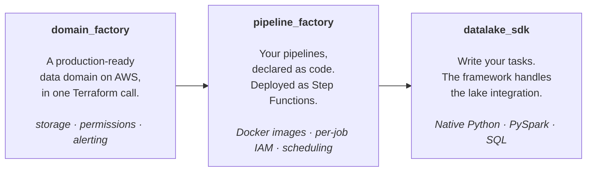

# AWS Data Platform Framework


A unified framework to industrialize data ingestion, transformation, and pipeline execution on
AWS using Terraform — from infrastructure provisioning to runtime execution. Reusable, standalone,
and ready to be dropped into a new AWS account.



## What you get

- **Domain provisioning, batteries included.** One Terraform module spins up everything a
  business domain needs: S3 (data + technical), a Glue database, Lake Formation registration,
  an Athena workgroup, IAM roles, ECR, a private CodeArtifact repository, EMR Studio, a
  Bedrock inference profile, sandbox base images for ECS and EMR, and a failsafe-shutdown
  Lambda. All resources are tagged for FinOps tracking.
- **Pipelines as code.** Declare your tasks in a single Terraform map; the framework builds
  Docker images, wires up a Step Functions state machine, ECS Fargate or EMR Serverless tasks,
  EventBridge schedules, IAM, CloudWatch logs, and failure notifications.
- **Two runtimes, one programming model.** Native Python (Pandas + awswrangler) on ECS Fargate
  for small-to-medium workloads; PySpark on EMR Serverless for big ones. Same SDK, same task
  contract — switch runtimes by changing one Terraform field.
- **Iceberg from day one.** All managed tables are Apache Iceberg → ACID transactions, schema
  evolution, time travel, partition evolution. Compaction and vacuum run automatically.
- **Multi-stage by default.** `dev`, `uat`, `prod`, … are isolated via Terraform workspaces.
  Resource names and database prefixes are derived automatically — no shared state, no
  copy-paste between environments.
- **Local–prod parity.** Run any task locally in the exact same Docker image used in
  production, with a Jupyter notebook attached for iteration.
- **Optional AI agent.** *Datalfred*, a Bedrock-backed agent, lets you query the lake, debug
  pipelines, and trigger ingestions in natural language. Disabled per-domain with
  `enable_llm = false` on the `domain_factory` call — skips Bedrock inference profile creation
  and stops the failsafe-shutdown Lambda from invoking Datalfred on pipeline failures.

## How it works

The framework is built around three concepts:

- A **domain** is a self-contained business unit. Provisioned by [`domain_factory/`](domain_factory),
  it owns its S3 buckets, Glue database, IAM, Lake Formation registration, and Athena workgroup.
- A **pipeline** orchestrates tasks within a domain. Provisioned by
  [`pipeline_factory/`](pipeline_factory) from a `tasks_configuration` map, it materializes as
  an AWS Step Functions state machine.
- A **task** is a unit of work — a Python module or a SQL file — packaged in a Docker image and
  run on ECS Fargate or EMR Serverless. Tasks read input tables and write output tables through
  the [`datalake_sdk`](datalake_sdk), which handles ingestion, schema management, and Lake
  Formation grants.

At runtime, Step Functions invokes each task with a callback token. The task uses the SDK to
ingest data into Iceberg tables on S3, registered in the Glue Data Catalog and governed by Lake
Formation. Athena provides SQL access on top.

## Quickstart

The fastest way to see the framework in action is to scaffold a domain via
[`cookiecutter_template/`](cookiecutter_template) — it provisions a complete domain plus a
minimal 2-task starter pipeline (`write_mock_data` → `transform`) you can rewrite. For a
broader, feature-exhaustive example, see [`integration_tests/`](integration_tests) (the in-tree
domain CI runs against).

Prerequisites:
* an AWS account
* (optional) an existing S3 bucket for Terraform state — leave the cookiecutter prompt empty to use a local backend instead
* a VPC tagged `Name = {project_name}_network_platform_prod` (the companion [`aws-network-stack`](https://github.com/erwan-simon/aws-network-stack) repo provisions one with the right tags, plus an optional NAT gateway via `nat_gateways_count` if you want to keep tasks in private subnets).

Full prerequisites in [`docs/deploying.md`](docs/deploying.md).

1. Install cookiecutter
```bash
pip install cookiecutter
```

2. Scaffold a project straight from the repo (interactive — it'll prompt for AWS account, project name, etc.). No need to clone first. Any `key=value` positional argument pre-fills a prompt — e.g. resolve the AWS account id from your shell:
```bash
cookiecutter https://github.com/erwan-simon/aws-data-platform-framework \
  --directory cookiecutter_template \
  aws_account_id=$(aws sts get-caller-identity --query Account --output text) \
  aws_region=$(aws configure get region) \
  dataplatform_version=$(git ls-remote --tags https://github.com/erwan-simon/aws-data-platform-framework | awk -F'/' '{print $NF}' | grep -v '\^{}$' | sort -V | tail -1)
```

3. Deploy
```bash
cd iac && \
    terraform init -backend-config=backend.hcl && \
    terraform workspace new dev && \
    terraform apply
```

If you left `terraform_backend_bucket_name` empty at scaffold time, the scaffold uses a local
backend — drop the `-backend-config=backend.hcl` flag and just run `terraform init`.

The pipeline is scheduled by default; you can also trigger it manually from the Step Functions
console (`{PROJECT_NAME}_{DOMAIN_NAME}_dev_{PIPELINE_NAME}`) once `terraform apply` completes.

To build your own deployment from scratch (consuming `domain_factory` and `pipeline_factory`
as remote Terraform modules pinned to a release tag), see the
[deployment guide](docs/deploying.md). To write your own tasks, see the
[pipeline-author guide](docs/pipelines.md).

## Concepts at a glance

| Concept     | What it is                                                                                          | Provisioned by                            |
|-------------|-----------------------------------------------------------------------------------------------------|-------------------------------------------|
| **Domain**  | The foundation: S3, Glue DB, IAM, Lake Formation, Athena workgroup, sandbox images.                 | [`domain_factory/`](domain_factory)       |
| **Pipeline**| A Step Functions workflow over a set of tasks, with triggers and failure notifications.             | [`pipeline_factory/`](pipeline_factory)   |
| **Task**    | A Python or SQL unit of work, run on ECS Fargate or EMR Serverless. Reads/writes Iceberg tables.    | `tasks_configuration` map in the pipeline |
| **Stage**   | An environment (`dev`, `prod`, …) derived from your Terraform workspace. Names and DB prefixes follow. | Terraform workspace                     |
| **Iceberg** | The on-disk format for every managed table. ACID, schema evolution, time travel.                    | Automatic                                 |

Resource names follow `{project_name}_{domain_name}_{stage_name}_…`. Non-prod stages prefix
database names (`dev_my_db`); `prod` uses the unprefixed name.

## Documentation

| If you want to…                          | Go to                                       |
|------------------------------------------|---------------------------------------------|
| Use the SDK (CLI or Python library)      | [`datalake_sdk/README.md`](datalake_sdk/README.md) |
| Deploy and operate the platform          | [`docs/deploying.md`](docs/deploying.md)    |
| Write a pipeline task                    | [`docs/pipelines.md`](docs/pipelines.md)    |

## Repository layout

```
.
├── datalake_sdk/         Python SDK and CLI used at runtime by tasks (and by humans)
├── domain_factory/       Terraform module — per-domain foundation
├── pipeline_factory/     Terraform module — pipelines from tasks_configuration
├── cookiecutter_template/ Scaffold for a new domain (minimal 2-task starter pipeline)
├── integration_tests/    In-tree, feature-exhaustive domain CI deploys end-to-end
├── scripts/              CI helpers (scaffold generator, integration test driver)
└── docs/                 In-depth guides (deployment, pipeline authoring)
```

## Requirements

- AWS account, AWS CLI configured
- Terraform with the AWS provider `>= 5.60.0, < 6.14.0`
- Python `~3.13` and Poetry (only if you build the SDK from source)
- Docker (for local task execution and image builds)
- A Terraform state backend — either an existing S3 bucket (set `terraform_backend_bucket_name` at scaffold time), or none (leave the prompt empty to use a local backend)
- A VPC tagged `Name = {project_name}_network_platform_prod` with `Tier`-tagged subnets — see [`aws-network-stack`](https://github.com/erwan-simon/aws-network-stack) for a ready-made stack (NAT gateway optional via `nat_gateways_count`)

See [`docs/deploying.md`](docs/deploying.md) for the full prerequisites checklist.

## License & Contributing

This project is licensed under [Creative Commons Attribution-NonCommercial 4.0](LICENSE).

The source of truth for development is GitLab; this GitHub repository is a read-only mirror
that runs `semantic-release` on the `prod` branch. Commits must follow
[Conventional Commits](https://www.conventionalcommits.org/) — versioning and SDK publication
are derived from commit messages.
