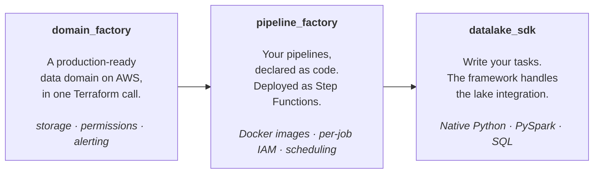

# AWS Data Platform Framework


A unified framework to industrialize data ingestion, transformation, and pipeline execution on
AWS using Terraform — from infrastructure provisioning to runtime execution. Reusable, standalone,
and ready to be dropped into a new AWS account.



## What you get

- **Domain provisioning in one Terraform call.** S3, Glue DB, Lake Formation, Athena workgroup,
  IAM, ECR, CodeArtifact, EMR Studio, Bedrock inference profile, ECS/EMR sandbox images,
  failsafe-shutdown Lambda. All resources tagged for FinOps.
- **Pipelines as code.** Declare tasks in a Terraform map; you get a Step Functions state
  machine over ECS Fargate or EMR Serverless tasks, with EventBridge triggers, IAM, logs, and
  failure alerts.
- **Two runtimes, one task contract.** Pandas + awswrangler on ECS Fargate for small/medium
  jobs, PySpark on EMR Serverless for big ones. Switch by changing one Terraform field.
- **Iceberg tables.** ACID, schema evolution, time travel, partition evolution. Compaction and
  vacuum run automatically.
- **Schema enforcement.** Declare column types and constraints (`ge`, `isin`, `str_matches`,
  `unique`, …) per output table; the SDK builds a [Pandera](https://pandera.readthedocs.io/)
  schema from the YAML and validates every DataFrame before writing. Same contract for Python
  and PySpark.
- **Multi-stage by Terraform workspaces.** `dev`, `uat`, `prod`, … isolated automatically —
  resource names and database prefixes derived from the workspace.
- **Local–prod parity.** Run any task locally in the same image used in production, with a
  Jupyter notebook attached.
- **Optional AI agent.** *Datalfred* — a Bedrock-backed agent for querying the lake and
  triggering ingestions in natural language. Off via `enable_llm = false`.
- **Claude Code integration.** Every scaffolded domain ships a `CLAUDE.md` plus skills to add
  tasks (`/new-task`), scaffold pipelines (`/new-pipeline`), and upgrade the framework
  (`/update-framework`) — Claude does the multi-file edits, the human reviews the diff.

## How it works

Step Functions invokes each task with a callback token. The task uses the SDK to ingest data
into Iceberg tables on S3, registered in the Glue Data Catalog and governed by Lake Formation.
Athena provides SQL access on top.

| Concept     | What it is                                                                    | Provisioned by                            |
|-------------|-------------------------------------------------------------------------------|-------------------------------------------|
| **Domain**  | S3, Glue DB, IAM, Lake Formation, Athena workgroup, sandbox images.           | [`domain_factory/`](domain_factory)       |
| **Pipeline**| Step Functions workflow over a set of tasks, with triggers and alerts.        | [`pipeline_factory/`](pipeline_factory)   |
| **Task**    | Python or SQL unit of work on ECS Fargate or EMR Serverless. Reads/writes Iceberg. | `tasks_configuration` map in the pipeline |
| **Stage**   | Environment (`dev`, `prod`, …) derived from the Terraform workspace.          | Terraform workspace                       |
| **Iceberg** | On-disk format for every managed table — ACID, schema evolution, time travel. | Automatic                                 |

Resource names follow `{project_name}_{domain_name}_{stage_name}_…`. Non-prod stages prefix
database names (`dev_my_db`); `prod` uses the unprefixed name.

## Quickstart

Scaffold a domain from [`cookiecutter_template/`](cookiecutter_template) — a minimal 2-task
starter pipeline (`write_mock_data` → `transform`) you rewrite. For a feature-exhaustive
example, see [`integration_tests/`](integration_tests).

Prerequisites:
* an AWS account
* [mise](https://mise.jdx.dev/) — installs the terraform/awscli/poetry versions pinned in the scaffold
* a running Docker daemon (Docker Desktop / OrbStack / colima) — needed at `terraform apply` time to build task images
* (optional) an existing S3 bucket for Terraform state — leave the cookiecutter prompt empty to use a local backend
* a VPC tagged `Name = {project_name}_network_platform_prod` — see [`aws-network-stack`](https://github.com/erwan-simon/aws-network-stack) for a ready-made one (NAT gateway optional via `nat_gateways_count`).

1. Install cookiecutter
```bash
pip install cookiecutter
```

2. Scaffold a domain (interactive prompts; pre-fill via `key=value` arguments).
```bash
cookiecutter https://github.com/erwan-simon/aws-data-platform-framework \
  --directory cookiecutter_template \
  aws_account_id=$(aws sts get-caller-identity --query Account --output text) \
  aws_region=$(aws configure get region) \
  dataplatform_version=vX.Y.Z
```
> Resolve the latest framework tag with:
> `git ls-remote --tags https://github.com/erwan-simon/aws-data-platform-framework | awk -F'/' '{print $NF}' | grep -v '\^{}$' | sort -V | tail -1`

3. Deploy
```bash
cd <domain_name>
mise install            # installs the terraform/awscli/poetry versions pinned in mise.toml
mise run deploy dev     # terraform init + workspace select/new + apply --auto-approve
```

The pipeline runs on schedule; trigger it manually via the Step Functions console
(`{PROJECT_NAME}_{DOMAIN_NAME}_dev_{PIPELINE_NAME}`) or `mise run run-pipeline dev <pipeline_name>`.

To consume `domain_factory` / `pipeline_factory` as remote Terraform modules pinned to a
release tag, see [`docs/deploying.md`](docs/deploying.md). To write tasks, see
[`docs/pipelines.md`](docs/pipelines.md).

## Documentation

| If you want to…                          | Go to                                       |
|------------------------------------------|---------------------------------------------|
| Use the SDK (CLI or Python library)      | [`datalake_sdk/README.md`](datalake_sdk/README.md) |
| Deploy and operate the platform          | [`docs/deploying.md`](docs/deploying.md)    |
| Write a pipeline task                    | [`docs/pipelines.md`](docs/pipelines.md)    |

## Repository layout

```
.
├── datalake_sdk/         Python SDK and CLI used at runtime by tasks (and by humans)
├── domain_factory/       Terraform module — per-domain foundation
├── pipeline_factory/     Terraform module — pipelines from tasks_configuration
├── cookiecutter_template/ Scaffold for a new domain (minimal 2-task starter pipeline)
├── integration_tests/    In-tree, feature-exhaustive domain CI deploys end-to-end
├── scripts/              CI helpers (scaffold generator, integration test driver)
└── docs/                 In-depth guides (deployment, pipeline authoring)
```

## License & Contributing

This project is licensed under [Creative Commons Attribution-NonCommercial 4.0](LICENSE).

The source of truth for development is GitLab; this GitHub repository is a read-only mirror
that runs `semantic-release` on the `prod` branch. Commits must follow
[Conventional Commits](https://www.conventionalcommits.org/) — versioning and SDK publication
are derived from commit messages.
